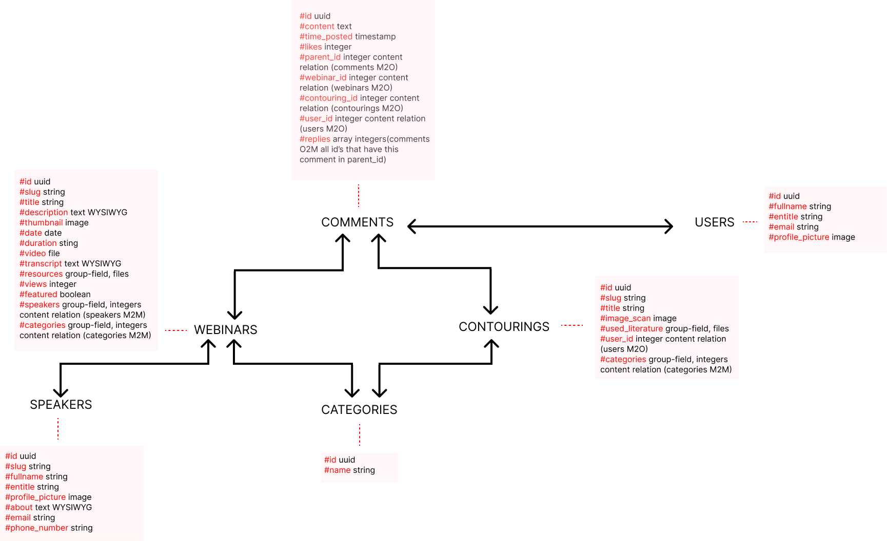

# How the code base works
Dit project is gebouwd met SvelteKit 4 en als CMS is Directus gebruikt. 

## Database
Je kunt de opstelling van de database hier zien.



Je kunt deze data aanpassen in de fdnd agency avl database waar je toegang voor moet vragen. Je kunt de tabellen hier vinden:
- [Webinars](https://fdnd-agency.directus.app/items/avl_webinars)
- [Speakers](https://fdnd-agency.directus.app/items/avl_speakers)
- [Contourings](https://fdnd-agency.directus.app/items/avl_contourings)
- [Comments](https://fdnd-agency.directus.app/items/avl_comments)
- [Categories](https://fdnd-agency.directus.app/items/avl_categories)
- [Users](https://fdnd-agency.directus.app/items/avl_users)

Deze links kun je gebruiken in je fech/post om de data uit de database op te halen/ aan te passen.

## Code structuur
Alle documenten die werkt met dynamische code staan in de map `src`. Alle statische documenten staan in de map `static`. 

`static` heeft de mappen `css`, `fonts` en `images`.

`src` is onderverdeeld in `lib`, waar herbruikbare documenten instaan, `routes`, waarin elke map een route naam is, en `app.html` wat de head van alle bestanden heeft. 

In de `lib` hebben we gebruik gemaakt van de LEGO methode om de componenten te sorteren. 
Ook hebben we een apparte map met alle JavaScript bestanden. In de `index.js` hallen we alle componenten op, zodat je maar 1 regel code hoeft te gebruiken om meerdere componenten in te laden.

## Belangrijke componenten

### Q&A sectie
De Q&A sectie is een nogal complex component. De Q&A section is opgebouwd uit de documenten `lib/Assemblages/q-a.svelte` en `lib/Blocks/comment.svelte`. 

Er worden forms met method post gebruikt voor het platsen van een comment, liken en reagerien op een comment. Al deze acties worden op de server afgehandeld. In het `+page.server.js` document van de pagina waar het component wordt gebruikt.

Op de serverside word de data uit de form gehaald. Zo min mogelijk data word via het form mee gegeven voor veiligheid. De data uit de database wordt gefechted en met een PATCH (like) of een POST (comment/reply) wordt de data aan/toe gepast in de database. 

Als er verder hieraan gewerkt wordt door een inlog systeem. Dan moet je in de PATCH en POST de user_id aanpassen naar die van de persoon die ingelogd is. Nu staat die hard gecodeerd op user 1.

Voor een voledige uitleg bekijk de [pullrequest](https://github.com/itsValyria/Oncollaboration/pull/6).

### Search
Als je de zoekbalk gebruikt wordt er een query gemaakt van je input deze query wordt toegevoegd aan de url (/search/query) waardoor de data van de website opniew gefetched word. Het gaat vervolgens door een filter waar gekeken word of de title van de webinar/contouring dit bevat zo ja dat word dit door gegeven en word deze data geladen in de zoek resultaten. 

Er is een apparte pagina search waar je heen gaat en de resultaten vind. De search zou uitgebrijd kunnen worden door bijvoorbeeld search tags toe te voegen aan de contourings en webinars.

Voor een voledige uitleg bekijk de [pullrequest](https://github.com/itsValyria/Oncollaboration/pull/1).

### Filter
Het filter wordt gebruikt op de webinars en contourings page. Je kunt filteren op 1 categorie dit is ook hoe de opdrachgever het wilt houden.

In de `+layout.server.js` word er gekeken wat de category is dat is mee gegeven via de filter. Hij staat standaard op "all".

Om ervoor te zorgen dat je op dezelfde pagina aan het filteren bent moet je in het `+page.server.js` document van de pagina waar het component wordt gebruikt een load functie aanmaken. Hierin gebruik je `parent` wat ervoor zorgt dat je de variablen van de `+layout.server.js` kunt gebruiken.

Je kijkt naar wat de categorie is en filterd de data en geeft deze nieuwe data door zodat alleen het gefilterde zichtbaar is.

```
export async function load({ parent }) {
    return parent().then(({ contourings, category }) => {
        if (category !== 'all') {
            contourings = contourings.filter((contourings) =>
                contourings.categories?.some((cat) =>
                cat.avl_categories_id?.name?.toLowerCase() === category
                )
            );
        }

        return {
            contourings
        }
    })
}
```

Je kunt hier meer over lezen in de pullrequests: [filter](https://github.com/itsValyria/Oncollaboration/pull/5) en [filter results fix](https://github.com/itsValyria/Oncollaboration/pull/14)