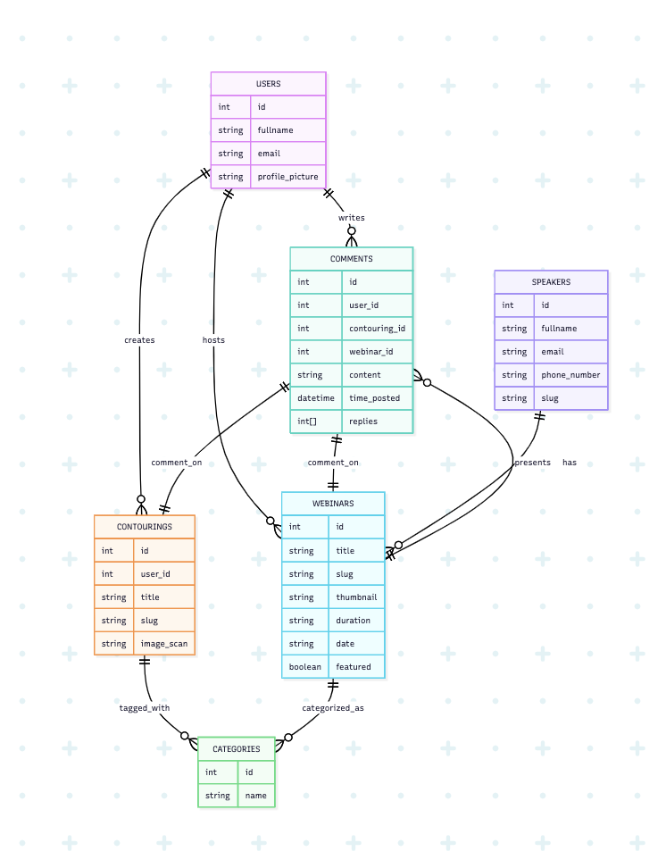

# How the code base works
This project is built with SvelteKit 5 and uses Directus as the CMS.

## Database
You can see the database setup here.



You can modify this data in the fdnd agency avl database, for which you need to request access. You can find the tables here:
- [Webinars](https://fdnd-agency.directus.app/items/avl_webinars)
- [Speakers](https://fdnd-agency.directus.app/items/avl_speakers)
- [Contourings](https://fdnd-agency.directus.app/items/avl_contourings)
- [Comments](https://fdnd-agency.directus.app/items/avl_comments)
- [Categories](https://fdnd-agency.directus.app/items/avl_categories)
- [Users](https://fdnd-agency.directus.app/items/avl_users)
- [Messages](https://fdnd-agency.directus.app/items/avl_messages)
- [Team](https://fdnd-agency.directus.app/items/avl_team)
- [Logo](https://fdnd-agency.directus.app/items/avl_logos)
- [Content](https://fdnd-agency.directus.app/items/avl_content)

You can use these links in your fetch/post requests to retrieve or modify data from the database.

## Code structure
All documents that work with dynamic code are in the `src` folder. 

`src` is divided into `lib`, which contains reusable documents, `routes`, where each folder is a route name, and `app.html`, which contains the head for all files.

In `index.js` we import some components, so you only need one line of code to import multiple components.

## Component Structure Overview

The `lib/` directory is organized into four folders of which three are component based: `assets`, `atoms`, `molecules` and `organisms`

## 1. Assets (`lib/assets/`)
SVG's and other images that are used around the website:

## 2. Atoms (`lib/atoms/`)
the most little building blocks of our organisms. These tiny parts of code start our components:
- **Webinars, Webinar detail and Home:** Each contains `organisms` and `molecules` are build with `atoms`.

## 3. Molecules (`lib/molcules/`)
The middle building bricks of organisms, molecules serve as conjoined elements serving as one. Example:
```svelte
<article>
    <div class="container-thumbnail">
        <Thumbnail webinar={webinar} ></Thumbnail>

        <BadgeLabel class="duration" text={webinar.duration}></BadgeLabel>

        <BadgeLabel class="category" text={webinar.categories[0].avl_categories_id.name}></BadgeLabel>

        <Button type="button" class="watchlist">
            Add to watchlist
            
        </Button>
    </div>

    <WebinarTitle as="h3">{webinar.title}</WebinarTitle>
    <Speaker as="p" class="speakers-fullname">{webinar.speakers[0].avl_speakers_id.fullname}</Speaker>

    <LinkButton class="to-webinar-detail" href={`/webinars/${webinar.slug}`}>
        View webinar
        <svg class="arrow" width="15" height="14" viewBox="0 0 15 14" fill="none" xmlns="http://www.w3.org/2000/svg">
            <path d="M6.8125 0.21875C6.9375 0.0625 7.1875 0.0625 7.34375 0.21875L13.875 6.75C14.0312 6.90625 14.0312 7.125 13.875 7.28125L7.34375 13.8125C7.1875 13.9688 6.9375 13.9688 6.8125 13.8125L6.1875 13.2188C6.03125 13.0625 6.03125 12.8125 6.1875 12.6875L11.0312 7.8125H0.375C0.15625 7.8125 0 7.65625 0 7.4375V6.5625C0 6.375 0.15625 6.1875 0.375 6.1875H11.0312L6.1875 1.34375C6.03125 1.21875 6.03125 0.96875 6.1875 0.8125L6.8125 0.21875Z" fill="currentColor"/>
        </svg>
    </LinkButton>
</article>
```

### 4 Organisms (`lib/organisms`)
The greatest of components. Great components like footer, header and logo-carousels are here. They are great works of molecules working together to make a whole. 
Examples of this:
```svelte
<script>
    import "$lib/global.css";
    import Logos from "$lib/atoms/header-logos.svelte";
    import Nav from  "$lib/molecules/header-nav.svelte";
</script>


<header>
    <Logos></Logos>
    <Nav></Nav>
</header>```

example of the layout:

```svelte
    <script>
        import "$lib/global.css";
        import Header from "$lib/organisms/header.svelte"
        import Footer from "$lib/organisms/footer.svelte"

        let { children } = $props();
    </script>

    <a href="#main-content" class="skip-link"> Skip to content </a>
    <Header></Header>
    <main id="main-content">
    {@render children?.()}
    </main>
    <Footer></Footer>


    <style>
            .skip-link {
            position: absolute;
            background-color: var(--primary-color-aqua-dark-3);
            color: var(--primary-color-blue-dark-2);
            border-radius: var(--border-radius-small);
            padding: 1em;
            margin: 1em;
            text-decoration: none;
            z-index: 1000;
            transform: translateY(-200%);
            transition: transform 0.3s;
            &:focus {
                transform: translate(0%);
            }
        }
    </style>
```

## Important components

### Header (`lib/organisms/header.svelte`)
The header is the the main way of navigating if you're on the top part of the page. Although our components aren't too complex, because we divide the work with atomic design the header is a fine work of atoms and molecules working together to make a well made organism. To see more about the header as a regular made code and finally a component see these pull-requests:

- [Header in simple code](https://github.com/fdnd-agency/oncollaboration/pull/307)
- [Header in a component](https://github.com/fdnd-agency/oncollaboration/pull/358)

### Footer (`lib/organisms/footer.svelte`)
As the header is the navigation for the top part of the page the footer is the way of navigation and even contact for the bottom of the page. The footer is quite similar to the header, but as mentioned previously it also has contact information placed in it. To see more about the footer as a regular made code and finally a component see these pull-requests:

- [Footer in simple code](https://github.com/fdnd-agency/oncollaboration/pull/309)
- [Footer in a component](https://github.com/fdnd-agency/oncollaboration/pull/399)

### Carousel (`lib/organisms/carrousel.svelte`)
The carrousel in this website is quite a fun and progressively enhanced one. It shows the partners that work together with Oncollaboration to make what it is today. The carrousel is interactive with the mouse when you hover above it and works on all devices. To see more about the carrousel see these pull requests:

- [Logo Carrousel simple code](https://github.com/fdnd-agency/oncollaboration/pull/305)
- [PE Logoscroller](https://github.com/fdnd-agency/oncollaboration/pull/310)
- [Logo Carrousel new color](https://github.com/fdnd-agency/oncollaboration/pull/394)

### Webinarcard (`lib/organisms/WebinarCard.svelte`)
The webinarcard is the most important part of the webinars page. It shows the webinars their cards with important pieces of information like: their category, the person giving the webinar,
the title of the webinar, saving the webinar in your watchlist and the duration of the webinar. It gives the user precise information on what they might need to know beforehand. To see more about the webinarcard see these pull-requests:

- [Webinarcard simple code](https://github.com/fdnd-agency/oncollaboration/pull/299)
- [Webinarcard component](https://github.com/fdnd-agency/oncollaboration/pull/398)

## Other important parts

### Use of Svelte and Sveltekit

We've talked a lot about Sveltekit and using it's components, but if you haven't worked with it before it might seem a lot. Sveltekit is a framework for webapplications that is to be used
on top of of Svelte which is a UI compiler. To use Sveltekit in an effective way is it's important that you understand how frameworks work and the usage of components. I will not go in detail here, but I will go over a few key features.

1. Routes: Routes are essential for a website as it is the thing that makes it able to be navigated through. Simply make a folder with the desired name and create a +page.svelte. You
have now created a new route in your website, congratulations.

2. Components: components are the very soul of frameworks. They are pieces of reuseable code throughout your website that are simply called by importing the link where the original code is placed. So if you wish to use the same button on every page is important to make that button a component so you'll only need to change the content within that button.

3. Server vs Client: Sveltekit is a natural in making SSR (server side rendering) easy. Not only does it automatically render your HTML onto the server which is great for performance, but you can also create layout.server.js and page.server.layout for data that needs to be shown on every page. Quite a handy feature

### Directus API
The Directus API is something that we have been using in previous project and this one as well. Directus is a headless CMS where you can create, manage and scale your content. We've been using is primarily to fetch, sort and filter the data in this project. To see more about Directus and it's ways of query parameters see these links:

- [Directus](https://directus.io/)
- [Sorting fields](https://directus.io/docs/guides/connect/query-parameters#search)
- [Filtering](https://directus.io/docs/guides/connect/filter-rules)